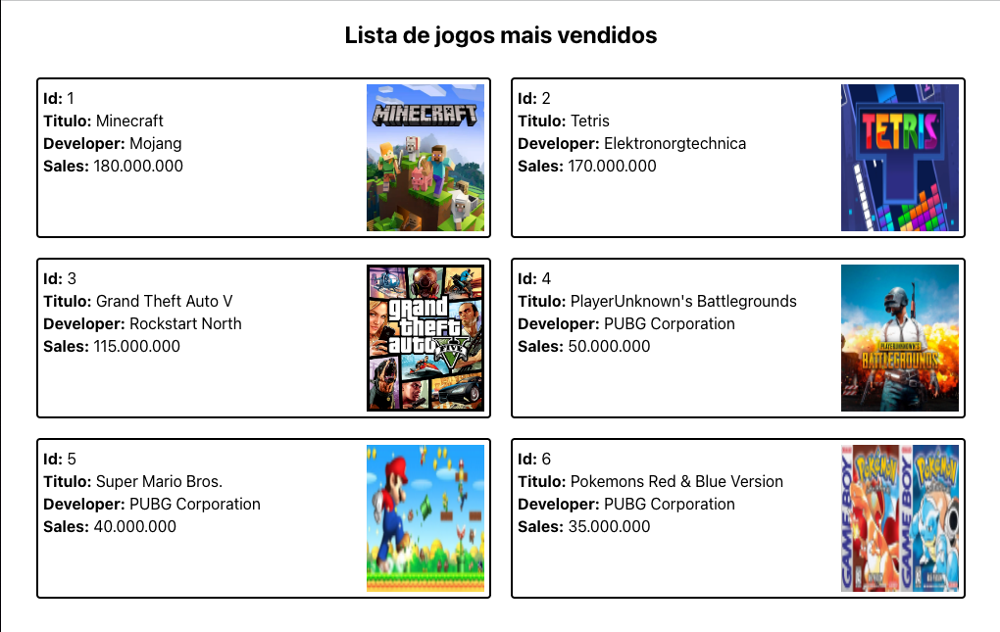

## Aula 10.2 - Componentes React 🧑🏻‍🏫

### Recapitulando a aula 10.1
- [ ] Criar o projeto com create-react-app
- [ ] Rever a estrutura do projeto criado
- [ ] Como criar um Componente baseado em classe (Class Component)

### Novas funcionalidades

- [ ] - JSX - Misturando o JavaScript com o HTML  
- [ ] - Renderizando variaveis no HTML  
- [ ] - Chamando funções no HTML  
  - [ ] - O THIS  
- [ ] - Renderizando listas no HTML  

### Componentização e código

- [ ] - Lista de Games em React  
- [ ] - Props  
- [ ] - PropTypes  

  

