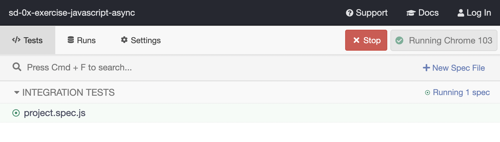

# Boas-vindas ao repositório!

Para realizar o exercício, atente-se a cada passo descrito a seguir, e se tiver qualquer dúvida, nos envie por _Slack_! #vqv 🚀
Aqui você vai encontrar os detalhes de como estruturar o desenvolvimento do seu exercício a partir deste repositório, utilizando uma branch específica e um _Pull Request_ para colocar seus códigos.

# Termos e acordos

Ao iniciar este exercício, você concorda com as diretrizes do [Código de Conduta e do Manual da Pessoa Estudante da Trybe](https://app.betrybe.com/manual-estudante/codigo-de-etica-e-conduta).

# Entregáveis

<details>
  <summary><strong>🤷🏽‍♀️ Como entregar</strong></summary><br />

  Para entregar o seu exercício você deverá criar um *Pull Request* neste repositório.

  Lembre-se que você pode consultar nosso conteúdo sobre [Git & GitHub](https://app.betrybe.com/course/4d67f5b4-34a6-489f-a205-b6c7dc50fc16/) e nosso [Blog - Git & GitHub](https://blog.betrybe.com/tecnologia/git-e-github/) sempre que precisar!
</details>

<details>
  <summary><strong>👨‍💻 O que deverá ser desenvolvido</strong></summary><br />

Prepare-se para mergulhar no mundo das criptomoedas! No exercício de hoje, vamos consultar uma API que retorna os valores de criptomoedas e, usando seus conhecimentos em desenvolvimento web, você deverá criar uma página para listar esses valores. Depois de listar todas criptomoeadas, o próximo desafio será listar apenas as 10 primeiras. 

Se você quiser se desafiar ainda mais, também teremos um requisito extra, onde você poderá consultar uma segunda API para converter o valor das criptomoedas para moeda local.

Aaahh, e não se esqueça de deixar sua aplicação estilizada para que ela brilhe ainda mais!

</details>

# Orientações

<details>
  <summary><strong>‼️ Antes de começar a desenvolver</strong></summary><br />

1. Clone o repositório
  * `git clone git@github.com:tryber/sd-024-a-exercise-javascript-async.git`.
  * Entre na pasta do repositório que você acabou de clonar:
    * `cd sd-024-a-exercise-javascript-async`

2. Instale as dependências e inicialize o exercício
  * Instale as dependências:
    * `npm install`

3. Crie uma branch a partir da branch `main`
  * Verifique que você está na branch `main`
    * Exemplo: `git branch`
  * Se não estiver, mude para a branch `main`
    * Exemplo: `git checkout main`
  * Agora, crie uma branch onde você vai guardar os `commits` do seu exercício
    * Você deve criar uma branch no seguinte formato: `nome-sobrenome-nome-do-exercício`
    * Exemplo: `git checkout -b maria-silva-javascript-async`

4. Quando fizer mudanças, adicione-as ao _stage_ do Git e faça um `commit`
  * Verifique que as mudanças ainda não estão no _stage_
    * Exemplo: `git status` (deve aparecer as alterações realizadas em vermelho)
  * Adicione o novo arquivo ao _stage_ do Git
      * Exemplo:
        * `git add .` (adicionando todas as mudanças - _que estavam em vermelho_ - ao stage do Git)
        * `git status` (deve aparecer listado os arquivos em verde)
  * Faça o `commit` inicial
      * Exemplo:
        * `git commit -m 'iniciando o exercício. VAMOS COM TUDO :rocket:'` (fazendo o primeiro commit)
        * `git status` (deve aparecer uma mensagem tipo _nothing to commit_ )

5. Adicione a sua branch com o novo `commit` ao repositório remoto
  * Usando o exemplo anterior: `git push -u origin maria-silva-javascript-async`

6. Crie um novo `Pull Request` _(PR)_
  * Vá até a página de _Pull Requests_ do [repositório no GitHub](https://github.com/tryber/sd-024-a-exercise-javascript-async/pulls)
  * Clique no botão verde _"New pull request"_
  * Clique na caixa de seleção _"Compare"_ e escolha a sua branch **com atenção**
    * Coloque um título para a sua _Pull Request_
    * Exemplo: _"Cria tela de busca"_
  * Clique no botão verde _"Create pull request"_
  * Adicione uma descrição para o _Pull Request_, um título claro que o identifique, e clique no botão verde _"Create pull request"_
  * **Não se preocupe em preencher mais nada por enquanto!**
  * Volte até a [página de _Pull Requests_ do repositório](https://github.com/tryber/sd-024-a-exercise-javascript-async/pulls) e confira que o seu _Pull Request_ está criado

</details>

<details>
  <summary><strong>⌨️ Durante o desenvolvimento</strong></summary><br />

  * Faça `commits` das alterações que você fizer no código regularmente;

  * Lembre-se de sempre atualizar o repositório remoto após um (ou alguns) `commits`;

  * Os comandos que você utilizará com mais frequência são:

    1. `git status` _(para verificar o que está em vermelho - fora do stage - e o que está em verde - no stage)_;

    2. `git add` _(para adicionar arquivos ao stage do Git)_;

    3. `git commit` _(para criar um commit com os arquivos que estão no stage do Git)_;

    4. `git push -u origin nome-da-branch` _(para enviar o commit para o repositório remoto na primeira vez que fizer o `push` de uma nova branch)_;

    5. `git push` _(para enviar o commit para o repositório remoto após o passo anterior)_.

</details>

<details>
  <summary><strong>🤝 Depois de terminar o desenvolvimento (opcional)</strong></summary><br />

  Para sinalizar que o seu exercício está pronto para o _"Code Review"_, faça o seguinte:

  - Vá até a página **DO SEU** _Pull Request_, adicione a label de _"code-review"_ e marque quem você deseja que realize o _code review_, por exemplo, as pessoas da sua tribo:

  - No menu à direita, clique no _link_ **"Labels"** e escolha a _label_ **code-review**;

  - No menu à direita, clique no _link_ **"Assignees"** e escolha **o seu usuário**;

   - No menu à direita, clique no _link_ **"Reviewers"** e digite `students`, selecione o time `tryber/students-sd-024-a`.

  Caso tenha alguma dúvida, [aqui tem um vídeo explicativo](https://vimeo.com/362189205).

</details>

<details>
  <summary><strong>🕵🏿 Revisando um pull request</strong></summary><br />

  Use o conteúdo sobre [Code Review](https://app.betrybe.com/course/real-life-engineer/code-review) para te ajudar a revisar os _Pull Requests_.

</details>

<details>
  <summary><strong>🛠 Testes</strong></summary><br />

* <details><summary><b> Execução de testes de requisito</b></summary>

  Os testes deste exercício foram feitos utilizando o [Cypress](https://www.cypress.io/how-it-works/). É utilizada nos testes a resolução `1366 x 768` (1366 pixels de largura por 768 pixels de altura) para testes de layout. Logo, recomenda-se desenvolver seu exercício usando a mesma resolução, via instalação [deste plugin](https://chrome.google.com/webstore/detail/window-resizer/kkelicaakdanhinjdeammmilcgefonfh?hl=en) do `Chrome` para facilitar a configuração dessa resolução, por exemplo.

  Para o exercício ser validado, todos os testes de comportamento devem passar. É possível testar isso local rodando `npm run cy`. Esse comando roda a suite de testes do Cypress que valida se o fluxo geral e os requisitos funcionais estão funcionando como deveriam. Você pode também executar o comando `npm run cy:open` para ter um resultado visual dos testes executados.

  Esses testes não consideram o layout de maneira geral, mas sim os atributos e informações corretas, então preste atenção nisso! Os testes te darão uma mensagem de erro caso não estejam passando (seja qual for o motivo). 😉
  </details>

* <details><summary><b> Execução de um teste específico</b></summary>

  Para executar somente uma `spec` de testes, você pode selecionar qual delas você deseja após executar o comando `npm run cy:open`. Além disto você pode rodar todas as `specs` clicando no botão `Run all specs`.

  

  **Atenção:** Sua aplicação deve estar rodando para o Cypress no terminal poder testar.
  </details>
</details>

</details>

  <details>
  <summary><strong>🗂 Compartilhe seu portfólio!</strong></summary><br />

  Você sabia que o LinkedIn é a principal rede social profissional e compartilhar o seu aprendizado lá é muito importante para quem deseja construir uma carreira de sucesso? Compartilhe esse exercício no seu LinkedIn, marque o perfil da Trybe (@trybe) e mostre para a sua rede toda a sua evolução.

</details>

⚠ **NESTE EXERCÍCIO O STYLELINT E ESLINT NÃO SERÃO AVALIADOS. VOCÊ PODE RODAR O TESTE LOCALMENTE E FAZER AS CORREÇÕES SE DESEJAR!** ⚠

---

# Mão na massa

# Exercícios

**⚠️ Atenção**

- A documentação para a `API` que vamos utilizar esta disponível nesse [link](https://docs.coincap.io/).

- Tente descobrir qual url vamos utilizar para buscar as informações que precisamos (um `array` com uma listagem das crypto moedas).
Se ficou na dúvida veja a seguir <strong>(spoiler alert!)</strong>

**Dica de ouro:** Por se tratar de uma API pública a quantidade de requisições a ela é limitada, caso você se depare com o seguinte erro: `FetchError: invalid json response body at (url da API) reason: Unexpected token T in JSON at position 0`, significa que você foi bloqueado temporariamente, basta esperar 1 ou 2 minutos para poder voltar a usar normalmente.

### 1 . Vamos consultar uma `API` que fornece os valores de crypto moedas

<details>
  <summary>Dentro da função <code> fetchCoins</code> implemente uma requisição, para consumir a <code>API</code> crypto moedas</summary><br />

  Leia a [documentação](https://docs.coincap.io/) e tente identificar qual o end point você deverá usar
<details>
<summary><strong> De olho na dica 👀 </strong></summary><br />

```
url: `https://api.coincap.io/v2/assets`
```
</details>


  - Dentro do arquivo `apiCoins.js` faça uma requisição para consumir a `API` dentro da função `fetchCoins` 
 
  > Dica: Utilize o `console.log` para ver se a requisição deu certo
  

<details>
    <summary><strong> Exemplo de como deve ficar na tela: </strong></summary><br />
  
```javascript
[
   {
    symbol: "BTC",
    name: "Bitcoin",
    priceUsd: "21913.4381395693292358",
    etc...
  },
  {
    symbol: "USDT",
    name: "Tether",
    priceUsd: "1.0001155957689619",
    etc...
  },
   etc...
 ]
```
</details> 


  - Pronto, temos um `array` com os dados das moedas e um esqueleto do HTML
  
</details>

  
 ### 2. Agora vamos fazer com que as moedas apareçam na tela. 
 
 <details>
  <summary> Dentro da <code> ul</code> com id <code>coins-list</code> crie uma <code>li</code> para cada moeda da requisição: </summary>
  
  - Todas as <code>li</code> devem estar dentro do <code>ul</code> com id <code>coins-list</code>

  - Utilize o seguinte formato: `Nome da moeda (símbolo da moeda): valor em dólares`. Exemplo: `Bitcoin (BTC): 46785.06`.

    - Utilizar template strings para mostra na tela `name`, `symbol` e `priceUsd`

    - Utilizar [`toFixed`](https://developer.mozilla.org/pt-BR/docs/Web/JavaScript/Reference/Global_Objects/Number/toFixed) para deixar o `priceUsd` com duas casas decimais
</details>  
  
  ### 3. Mostrar somente as 10 primeiras moedas da requisição
  
 <details>
  <summary> Conseguiu mostrar as moedas na tela? Agora, que tal filtrar o array das moedas para mostrar apenas as 10 primeiras? </summary><br />

   <details>
    <summary><strong> De olho na dica 👀 </strong></summary><br />

     Tente pesquisar no google "exibir os primeiros elementos de um array javascript"
   </details> 
 </details> 
  
---

### Exercício extra (não é testado pelo avaliador)

 <details>
  <summary>Que tal usarmos uma API para converter o preço das criptomoedas para a nossa moeda local ao invés de mostrar o seu valor em dólar?</summary><br />

  Para isto, vamos utilizar a [Currency API](https://github.com/fawazahmed0/currency-api#readme). Tente descobrir qual url retorna os dados necessários para este exercício, mas, caso fique na dúvida, pode consultar a informação abaixo:

  <details>
  <summary><strong> De olho na dica 👀 </strong></summary><br />

```js
  baseUrl: `https://cdn.jsdelivr.net/gh/fawazahmed0/currency-api@1/latest`  
  endpoint: `/currencies/usd.min.json`
```
  </details> 
 </details> 

---
### (OPCIONAL) Depois de terminar o desenvolvimento

- Não se esqueça de estilizar a página conforme o seu estilo (tanto no CSS quanto no HTML).
