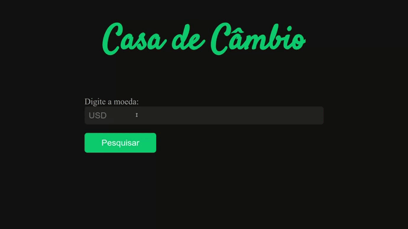

# Repositório do projeto Casa de Cambio da Turma 24 - Tribos A e B

## Começando

Basta clonar o repositório:

```
git clone git@github.com:tryber/sd-024-casa-de-cambio.git
```

# Casa de Câmbio

Melhor site para consultar câmbios do mundo. Não! Da galáxia... Não! do universo.
<p align='center'>
  
</p>

Nesse site utilizamos o serviço https://exchangerate.host/

## Bônus para praticar 💚

> Preparamos essa lista de exercícios **NÃO OBRIGATÓRIOS** para vocês se divertirem 🙂

> *Não haverá correção automatizada pelo avaliador.*

1. Adicione um botão "limpar" que, ao ser clicado, apaga toda a listagem de moedas;

2. Inclua a opção de ordenar a lista de moedas por ordem de Z-A;

3. Inclua a opção para a pessoa usuária converter qualquer valor que ela digite. Exemplo Moeda: USD; Valor: 5, então todos os valores das outras moedas devem ser relacionados aos 5 dólares.
