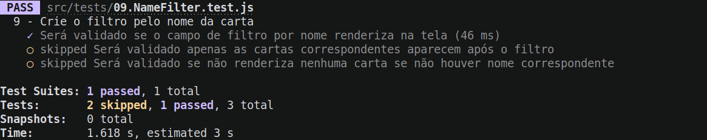
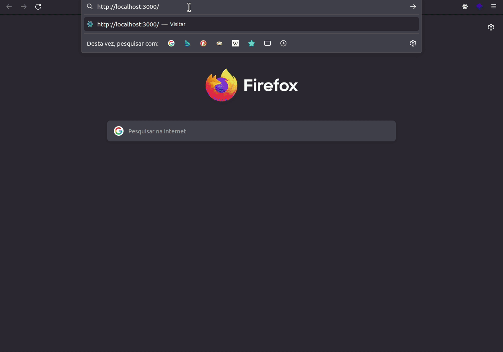

# Boas-vindas ao repositório do exercício Dog Image!

Para realizar o exercício, atente-se a cada passo descrito a seguir e, se tiver qualquer dúvida, nos envie por _Slack_! #vqv 🚀

Aqui você vai encontrar os detalhes de como estruturar o desenvolvimento do seu exercício a partir deste repositório, utilizando uma branch específica e um _Pull Request_ (PR) para colocar seus códigos.

# Termos e acordos

Ao iniciar este exercício, você concorda com as diretrizes do Código de Conduta e do Manual da Pessoa Estudante da Trybe.

# Entregáveis

<details>
  <summary><strong>🤷🏽‍♀️ Como entregar</strong></summary><br />

Para entregar o seu exercício você deverá criar um _Pull Request_ neste repositório.

Lembre-se que você pode consultar nosso conteúdo sobre [Git & GitHub](https://app.betrybe.com/course/4d67f5b4-34a6-489f-a205-b6c7dc50fc16/) e nosso [Blog - Git & GitHub](https://blog.betrybe.com/tecnologia/git-e-github/) sempre que precisar!

</details>

<details>
  <summary><strong>👨‍💻 O que deverá ser desenvolvido</strong></summary><br />

Neste exercício você vai desenvolver uma página que consome a API [dog.ceo](https://dog.ceo/dog-api/) de fotos aleatórias de cachorros!

Caso você tenha alguma dúvida sobre como fazer requisições, [consulte a documentação](https://developer.mozilla.org/pt-BR/docs/Web/API/Fetch_API/Using_Fetch) para ter mais informações!

Observe a estrutura de dados que a API retorna:

```bash
{
    "message": "https://images.dog.ceo/breeds/bulldog-french/n02108915_5306.jpg",
    "status": "success"
}
```

</details>

<details>
  <summary><strong>:memo: Habilidades</strong></summary><br />

Neste exercício, verificamos se você é capaz de:

- Ler o estado de um componente e usá-lo para alterar o que exibimos no browser

- Atualizar o estado de um componente

- Capturar eventos utilizando a sintaxe do React

- Utilizar os Ciclos de Vida de Componentes React

</details>

# Orientações

<details>
  <summary><strong>‼️ Antes de começar a desenvolver</strong></summary><br />

1. Clone o repositório

- Use o comando: `git clone git@github.com:tryber/sd-024-a-exercise-dog-image`.
- Entre na pasta do repositório que você acabou de clonar:
  - `cd sd-024-a-exercise-dog-image`

2. Instale as dependências

- `npm install`.

3. Crie uma branch a partir da branch `main`

- Verifique que você está na branch `main`
  - Exemplo: `git branch`
- Se não estiver, mude para a branch `main`
  - Exemplo: `git checkout main`
- Agora crie uma branch à qual você vai submeter os `commits` do seu exercício
  - Você deve criar uma branch no seguinte formato: `nome-de-usuario-nome-do-exercicio`
  - Exemplo: `git checkout -b joaozinho-sd-024-a-exercise-dog-image`

4. Adicione as mudanças ao _stage_ do Git e faça um `commit`

- Verifique que as mudanças ainda não estão no _stage_
  - Exemplo: `git status` (deve aparecer listada a pasta _joaozinho_ em vermelho)
- Adicione o novo arquivo ao _stage_ do Git
  - Exemplo:
    - `git add .` (adicionando todas as mudanças - _que estavam em vermelho_ - ao stage do Git)
    - `git status` (deve aparecer listado o arquivo _joaozinho/README.md_ em verde)
- Faça o `commit` inicial
  - Exemplo:
    - `git commit -m 'iniciando o exercício x'` (fazendo o primeiro commit)
    - `git status` (deve aparecer uma mensagem tipo _nothing to commit_ )

5. Adicione a sua branch com o novo `commit` ao repositório remoto

- Usando o exemplo anterior: `git push -u origin joaozinho-sd-024-a-exercise-dog-image`

6. Crie um novo `Pull Request` _(PR)_

- Vá até a página de _Pull Requests_ do [repositório no GitHub](https://github.com/tryber/sd-024-a-exercise-dog-image/pulls)
- Clique no botão verde _"New pull request"_
- Clique na caixa de seleção _"Compare"_ e escolha a sua branch **com atenção**
- Coloque um título para a sua _Pull Request_
  - Exemplo: _"Cria tela de busca"_
- Clique no botão verde _"Create pull request"_
- Adicione uma descrição para o _Pull Request_ e clique no botão verde _"Create pull request"_
- **Não se preocupe em preencher mais nada por enquanto!**
- Volte até a [página de _Pull Requests_ do repositório](https://github.com/tryber/sd-024-a-exercise-dog-image/pulls) e confira que o seu _Pull Request_ está criado

</details>

<details>
  <summary><strong>⌨️ Durante o desenvolvimento</strong></summary><br />

- Faça `commits` das alterações que você fizer no código regularmente

- Lembre-se de sempre após um (ou alguns) `commits` atualizar o repositório remoto

- Os comandos que você utilizará com mais frequência são:
  1. `git status` _(para verificar o que está em vermelho - fora do stage - e o que está em verde - no stage)_
  2. `git add` _(para adicionar arquivos ao stage do Git)_
  3. `git commit` _(para criar um commit com os arquivos que estão no stage do Git)_
  4. `git push -u origin nome-da-branch` _(para enviar o commit para o repositório remoto na primeira vez que fizer o `push` de uma nova branch)_
  5. `git push` _(para enviar o commit para o repositório remoto após o passo anterior)_

</details>

<details>
  <summary><strong>🤝 Depois de terminar o desenvolvimento (opcional)</strong></summary><br />

Para sinalizar que o seu exercício está pronto para o _"Code Review"_, faça o seguinte:

- Vá até a página **DO SEU** _Pull Request_, adicione a label de _"code-review"_ e marque seus colegas:

  - No menu à direita, clique no _link_ **"Labels"** e escolha a _label_ **code-review**;

  - No menu à direita, clique no _link_ **"Assignees"** e escolha **o seu usuário**;

  - No menu à direita, clique no _link_ **"Reviewers"** e digite `students`, selecione o time `tryber/students-sd-024-a`.

Caso tenha alguma dúvida, [aqui tem um video explicativo](https://vimeo.com/362189205).

</details>

<details>
  <summary><strong>🕵🏿 Revisando um pull request</strong></summary><br />

Use o conteúdo sobre [Code Review](https://course.betrybe.com/real-life-engineer/code-review/) para te ajudar a revisar os _Pull Requests_.

</details>

<details>
  <summary><strong>🎛 Linter</strong></summary><br />

Para garantir a qualidade do código, vamos utilizar neste exercício os linters `ESLint` e `StyleLint`.
Assim o código estará alinhado com as boas práticas de desenvolvimento, sendo mais legível
e de fácil manutenção! Para rodá-los localmente no exercício, execute os comandos abaixo:

```bash
  npm run lint
  npm run lint:styles
```

⚠️ **PULL REQUESTS COM ISSUES DE LINTER NÃO SERÃO AVALIADAS.
ATENTE-SE PARA RESOLVÊ-LAS ANTES DE FINALIZAR O DESENVOLVIMENTO!** ⚠️

Em caso de dúvidas, confira o material do course sobre [ESLint e Stylelint](https://app.betrybe.com/course/real-life-engineer/eslint).

</details>

<details>
  <summary><strong>🛠 Testes</strong></summary><br />

Para avaliar o exercício iremos utilizar [React Testing Library](https://testing-library.com/docs/react-testing-library/intro) para execução dos testes.

Esse _framework_ de testes utiliza algumas marcações no código para verificar a solução proposta, uma dessas marcações é o atributo `data-testid` e faremos uso dele aqui.

Na descrição dos requisitos (logo abaixo) será pedido que seja feita a adição de atributos `data-testid` nos elementos _HTML_. Vamos a um exemplo para deixar claro essa configuração:

Se o requisito pedir "crie um botão e adicione o id de teste (ou `data-testid`) com o valor `my-action`, você pode criar:

```html
<button data-testid="my-action"></button>
```

ou

```html
<a data-testid="my-action"></a>
```

Ou seja, o atributo `data-testid="my-action"` servirá para o React Testing Library(RTL) identificar o elemento e dessa forma, conseguiremos realizar testes focados no comportamento da aplicação.

Em alguns requisitos, utilizamos o `getByRole` para poder selecionar os elementos de forma semântica. Portanto atente-se às instruções de cada requisito. Por exemplo, se o requisito pedir explicitamente um `button`, você deverá utilizar exatamente esse elemento.

Afim de verificar a solução proposta, você pode executar todos os testes localmente, basta executar:

```bash
npm test
```

### Dica: desativando testes

Especialmente no início, quando a maioria dos testes está falhando, a saída após executar os testes é extensa. Você pode desabilitar temporariamente um teste utilizando a função `skip` junto à função `it`. Como o nome indica, esta função "pula" um teste. Veja um exemplo:

```js
it.skip("Será validado se o campo de filtro por nome renderiza na tela", () => {
  render(<App />);
  const filterNameInput = screen.getByTestId(/name-filter/i);
  expect(filterNameInput).toBeInTheDocument();
});
```


Uma estratégia é pular todos os testes no início e ir implementando um teste de cada vez, removendo dele a função `skip`.

Você também pode rodar apenas um arquivo de teste, por exemplo:

```bash
npm test 01.Form.test.js
```

ou

```bash
npm test 01.Form
```

Uma outra forma para contornar esse problema é a utilização da função `.only` após o `it`. Com isso, será possível que apenas um requisito rode localmente e seja avaliado.

```js
it.only("Será validado se o campo de filtro por nome renderiza na tela", () => {
  render(<App />);
  const filterNameInput = screen.getByTestId(/name-filter/i);
  expect(filterNameInput).toBeInTheDocument();
});
```



⚠️ **O avaliador automático não necessariamente avalia seu exercício na ordem em que os requisitos aparecem no readme. Isso acontece para deixar o processo de avaliação mais rápido. Então, não se assuste se isso acontecer, ok?**

</details>

<details>
  <summary><strong>:convenience_store: Desenvolvimento </strong></summary><br />

  Nesse exercício você deve desenvolver uma aplicação React que fará requisições para uma API externa, a [dog.ceo](https://dog.ceo/dog-api/), para recuperar imagens de ~doguinhos fofinhos~ cachorros.
  
  Sua aplicação deve renderizar essas imagens, exibir mais informações sobre o cachorro e gerenciar o estado dos componentes, além de salvar as informações na `localSotrage`.
</details>

<details>
  <summary><strong>🗂 Compartilhe seu portfólio!</strong></summary><br />

Você sabia que o LinkedIn é a principal rede social profissional e compartilhar o seu aprendizado lá é muito importante para quem deseja construir uma carreira de sucesso? Compartilhe esse exercício no seu LinkedIn, marque o perfil da Trybe (@trybe) e mostre para a sua rede toda a sua evolução.

</details>

# Requisitos

:warning: Os gifs são meramente ilustrativos para visualizar o fluxo da aplicação. Portanto, os nomes devem seguir os requisitos e não o gif. :warning:

## 1. Crie uma aplicação que consuma a API de fotos aleatórias de cachorros

Nesse exercício você deve desenvolver uma aplicação React que fará requisições para uma API externa, a `dog.ceo` no endpoint https://dog.ceo/api/breeds/image/random para recuperar imagens de doguinhos. Todo seu código deverá ser implementado no `App.js`. 

Ao utilizar essa aplicação uma pessoa usuária deverá ser capaz de:

- Fazer uma requisição para a API (endpoint: https://dog.ceo/api/breeds/image/random), para recuperar imagens de doguinhos aleatórios.
  - > 👀 **De olho na dica:** utilize o método `componentDidMount`. Uma dica para seu estado inicial é usar as chaves `imageUrl` e `isLoading`.

- Visualizar uma foto aleatória de um doguinho assim que a página for montada.

- Na primeira vez em que a página carrega, o texto "Loading..." deve ser a única coisa presente na tela.

- Ao receber o retorno da requisição, uma imagem deve ser renderizada com a URL recebida da API. Essa imagem deve ter o atributo `alt` com o valor "Doguinho aleatório".

- Deve existir um botão que dispare uma nova requisição para API quando for clicado. Esse botão deve ter o texto "Novo doguinho!". 
  - > 👀 **De olho na dica:** Atenção, nesta nova requisição, não é necessário mostrar novamente o `Loading...`

<details>
  <summary><strong>Imagem da aplicação</strong></summary><br />

  

</details>

<details>
  <summary><strong>O que será verificado</strong></summary><br />


- Será verificado se existe um texto `Loading...` presente na tela enquanto a requisição é feita.

- Será verificado se existe uma imagem com o atributo `alt` com valor `Doguinho aleatório`.

- Será verificado se a imagem renderizada possui o atributo `src` com o valor da URL recebida da API.

- Será verificado se existe um botão com o texto `Novo doguinho!`.

</details>

---

## 2. Adicione algumas ações após receber o retorno da requisição para API

- A cada tentativa de atualização do componente, verifique se a URL da imagem possui a palavra `terrier`. Caso tenha, **não** atualize o componente. 

> 👀 **De olho na dica:** pesquise pelo método `includes` e utilize o método `shouldComponentUpdate`. 

- Guarde a URL da última imagem gerada no `localStorage` após cada atualização, utilizando o método `componentDidUpdate`.

- Após a atualização do componente, exiba um `alert` com a raça do doguinho.

> 👀 **De olho na dica:** utilize o método `split` para pegar a raça a partir da URL da imagem e utilize o método `componentDidUpdate`.


<details>
  <summary><strong>O que será verificado</strong></summary><br />

- Será verificado se, quando a URL da imagem possuir a palavra `terrier`, o componente **não** é atualizado.

- Será verificado se a imagem gerada é salva no `localStorage`.

- Será verificado se um `alert` é exibido informando a raça do doguinho.

</details>

---

## 3. Exercício extra (não é testado pelo avaliador) - Adicione outras funcionalidades à página

- Verifique se existem dados prévios guardados no `localStorage` quando a página é carregada.
- Recupere a url da imagem diretamente do `localStorage`, sem fazer um novo fetch.
  - **OBS**: Se o `localStorage` não possuir dados, prossiga com o fluxo normal (fazendo uma nova requisição).
- Renderize a imagem na aplicação com a url recuperada.

---
