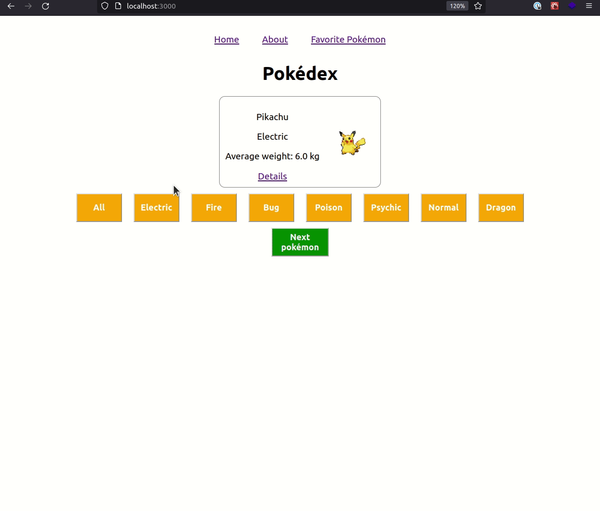
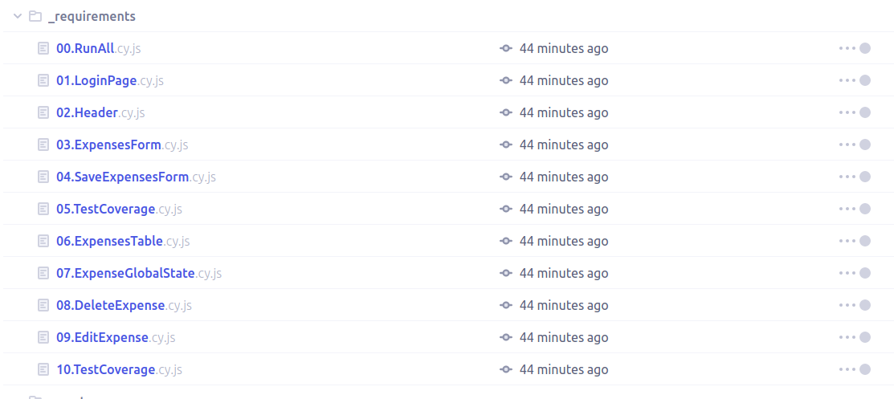

# Boas-vindas ao repositório do exercício Pokédex Router!

Para realizar o exercício, atente-se a cada passo descrito a seguir e, se tiver qualquer dúvida, nos envie por _Slack_! #vqv 🚀

Aqui você vai encontrar os detalhes de como estruturar o desenvolvimento do seu exercício a partir deste repositório, utilizando uma branch específica e um _Pull Request_ (PR) para colocar seus códigos.

# Termos e acordos

Ao iniciar este exercício, você concorda com as diretrizes do Código de Conduta e do Manual da Pessoa Estudante da Trybe.

# Entregáveis

<details>
  <summary><strong>🤷🏽‍♀️ Como entregar</strong></summary><br />

Para entregar o seu exercício você deverá criar um _Pull Request_ neste repositório.

Lembre-se que você pode consultar nosso conteúdo sobre [Git & GitHub](https://app.betrybe.com/course/4d67f5b4-34a6-489f-a205-b6c7dc50fc16/) e nosso [Blog - Git & GitHub](https://blog.betrybe.com/tecnologia/git-e-github/) sempre que precisar!

</details>

<details>
  <summary><strong>👨‍💻 O que deverá ser desenvolvido</strong></summary><br />

O desafio de hoje é incrementar uma aplicação de Pokédex utilizando React Router. Para isso, você terá acesso a um repositório com aplicação React funcionando, o qual exibe um card com informações de um Pokémon e um botão para navegar entre uma lista de Pokémon, sendo possível filtrar por tipos específicos.

Além dessas funcionalidades, você terá como missão adicionar novas rotas na aplicação, para que seja possível visualizar mais informações de cada Pokémon e poder _favoritar_ os Pokémon que você mais gosta.
  
Aviso: A biblioteca `react-router-dom` já está instalada, então você só precisa executar o comando `npm install` estando dentro da pasta raiz para poder utilizá-la.

Veja um exemplo da aplicação rodando:



</details>

<details>
  <summary><strong>:memo: Habilidades</strong></summary><br />

Neste exercício, verificamos se você é capaz de:

- Utilizar o componente BrowserRouter corretamente;

- Criar links de navegação na aplicação com o componente Link;
  
- Criar rotas, mapeando o caminho da URL com o componente correspondente, via Route;
  
- Estruturar e organizar as rotas da sua aplicação com o componente Switch;
  
- Usar o componente Redirect pra alternar entre rotas.

</details>

# Orientações

<details>
  <summary><strong>‼️ Antes de começar a desenvolver</strong></summary><br />

1. Clone o repositório

- Use o comando: `git clone git@github.com:tryber/sd-024-a-exercise-pokedex-router`.
- Entre na pasta do repositório que você acabou de clonar:
  - `cd sd-024-a-exercise-pokedex-router`

2. Instale as dependências

- `npm install`.

3. Crie uma branch a partir da branch `main`

- Verifique que você está na branch `main`
  - Exemplo: `git branch`
- Se não estiver, mude para a branch `main`
  - Exemplo: `git checkout main`
- Agora crie uma branch à qual você vai submeter os `commits` do seu exercício
  - Você deve criar uma branch no seguinte formato: `nome-de-usuario-nome-do-exercicio`
  - Exemplo: `git checkout -b joaozinho-sd-024-a-exercise-pokedex-router`

4. Adicione as mudanças ao _stage_ do Git e faça um `commit`

- Verifique que as mudanças ainda não estão no _stage_
  - Exemplo: `git status` (deve aparecer listada a pasta _joaozinho_ em vermelho)
- Adicione o novo arquivo ao _stage_ do Git
  - Exemplo:
    - `git add .` (adicionando todas as mudanças - _que estavam em vermelho_ - ao stage do Git)
    - `git status` (deve aparecer listado o arquivo _joaozinho/README.md_ em verde)
- Faça o `commit` inicial
  - Exemplo:
    - `git commit -m 'iniciando o exercício x'` (fazendo o primeiro commit)
    - `git status` (deve aparecer uma mensagem tipo _nothing to commit_ )

5. Adicione a sua branch com o novo `commit` ao repositório remoto

- Usando o exemplo anterior: `git push -u origin joaozinho-sd-024-a-exercise-pokedex-router`

6. Crie um novo `Pull Request` _(PR)_

- Vá até a página de _Pull Requests_ do [repositório no GitHub](https://github.com/tryber/sd-024-a-exercise-pokedex-router/pulls)
- Clique no botão verde _"New pull request"_
- Clique na caixa de seleção _"Compare"_ e escolha a sua branch **com atenção**
- Coloque um título para a sua _Pull Request_
  - Exemplo: _"Cria tela de busca"_
- Clique no botão verde _"Create pull request"_
- Adicione uma descrição para o _Pull Request_ e clique no botão verde _"Create pull request"_
- **Não se preocupe em preencher mais nada por enquanto!**
- Volte até a [página de _Pull Requests_ do repositório](https://github.com/tryber/sd-024-a-exercise-pokedex-router/pulls) e confira que o seu _Pull Request_ está criado

</details>

<details>
  <summary><strong>⌨️ Durante o desenvolvimento</strong></summary><br />

- Faça `commits` das alterações que você fizer no código regularmente

- Lembre-se de sempre após um (ou alguns) `commits` atualizar o repositório remoto

- Os comandos que você utilizará com mais frequência são:
  1. `git status` _(para verificar o que está em vermelho - fora do stage - e o que está em verde - no stage)_
  2. `git add` _(para adicionar arquivos ao stage do Git)_
  3. `git commit` _(para criar um commit com os arquivos que estão no stage do Git)_
  4. `git push -u origin nome-da-branch` _(para enviar o commit para o repositório remoto na primeira vez que fizer o `push` de uma nova branch)_
  5. `git push` _(para enviar o commit para o repositório remoto após o passo anterior)_

</details>

<details>
  <summary><strong>🤝 Depois de terminar o desenvolvimento (opcional)</strong></summary><br />

Para sinalizar que o seu exercício está pronto para o _"Code Review"_, faça o seguinte:

- Vá até a página **DO SEU** _Pull Request_, adicione a label de _"code-review"_ e marque seus colegas:

  - No menu à direita, clique no _link_ **"Labels"** e escolha a _label_ **code-review**;

  - No menu à direita, clique no _link_ **"Assignees"** e escolha **o seu usuário**;

  - No menu à direita, clique no _link_ **"Reviewers"** e digite `students`, selecione o time `tryber/students-sd-024-a`.

Caso tenha alguma dúvida, [aqui tem um video explicativo](https://vimeo.com/362189205).

</details>

<details>
  <summary><strong>🕵🏿 Revisando um pull request</strong></summary><br />

Use o conteúdo sobre [Code Review](https://app.betrybe.com/course/real-life-engineer/code-review) para te ajudar a revisar os _Pull Requests_.

</details>

<details>
  <summary><strong>🎛 Linter</strong></summary><br />

Para garantir a qualidade do código, vamos utilizar neste exercício os linters `ESLint` e `StyleLint`.
Assim o código estará alinhado com as boas práticas de desenvolvimento, sendo mais legível
e de fácil manutenção! Para rodá-los localmente, execute os comandos abaixo:

```bash
  npm run lint
  npm run lint:styles
```

⚠️ **PULL REQUESTS COM ISSUES DE LINTER NÃO SERÃO AVALIADAS.
ATENTE-SE PARA RESOLVÊ-LAS ANTES DE FINALIZAR O DESENVOLVIMENTO!** ⚠️

Em caso de dúvidas, confira o material do course sobre [ESLint e Stylelint](https://app.betrybe.com/course/real-life-engineer/eslint).

</details>


<details>
  <summary><strong>🛠 Testes</strong></summary><br />

* <details><summary><b>Execução de testes de requisito</b></summary>

  Os testes deste exercício foram feitos usando o [Cypress](https://www.cypress.io/how-it-works/). É utilizada nos testes a resolução `1366 x 768` (1366 pixels de largura por 768 pixels de altura) para testes de layout. Logo, recomenda-se desenvolver seu exercício usando a mesma resolução, via instalação [deste plugin](https://chrome.google.com/webstore/detail/window-resizer/kkelicaakdanhinjdeammmilcgefonfh?hl=en) do `Chrome`, de modo a facilitar a configuração dessa resolução, por exemplo.

  Para o exercício ser validado, todos os testes de comportamento devem passar. É possível testar isso localmente rodando `npm run cy`. Esse comando roda a suite de testes do Cypress, o qual valida se o fluxo geral e os requisitos funcionais estão como deveriam.

  > Você também pode executar o comando `npm run cy:open` para ter um resultado visual dos testes feitos.

  Aviso: Esses testes não consideram o layout de maneira geral, mas sim os atributos e informações corretas, por isso preste atenção! Os testes te darão uma mensagem de erro caso não estejam passando (seja qual for o motivo). 😉

  **Atenção:** Sua aplicação deve estar rodando para o Cypress no terminal poder testar.
  </details><br />

* <details><summary><b> Execução de um teste específico</b></summary>

  Para executar somente uma `spec` de testes, você pode ou rodar somente um arquivo de teste com o comando `npm run cy -- --spec cypress/integration/nomeDoArquivo_spec.js`, ou selecionar qual delas você deseja após executar o comando `npm run cy:open`.

  

  Além disso, ainda é possível rodar apenas um trecho de um `spec`, basta utilizar a função .only após o `describe`, `it` ou `test`. Com isso, será possível que apenas parte de um teste rode localmente e seja avaliado.

  

  </details><br />
</details>


<details>
  <summary><strong>🗂 Compartilhe seu portfólio!</strong></summary><br />

Você sabia que o LinkedIn é a principal rede social profissional e compartilhar o seu aprendizado lá é muito importante para quem deseja construir uma carreira de sucesso? Compartilhe esse exercício no seu LinkedIn, marque o perfil da Trybe (@trybe) e mostre para a sua rede toda a sua evolução.

</details>

# Requisitos

## 1 - Criar duas rotas para a aplicação, a rota principal `/` e a rota `/about`

<details>
  <summary>Crie as duas primeiras rotas para a aplicação</summary><br />

- A rota `/` deve renderizar somente o componente `<Pokedex />`.
- Crie um componente chamado `<About />` e coloque um título com o texto `About Pokédex`.
- Crie a rota `/about` e renderize somente o componente `<About />`

</details>

<details>
  <summary><strong>O que será verificado</strong></summary><br />

- Se, ao entrar na rota `/`: 
  - é renderizado uma tag `h1` com o texto `Pokédex`.
  - as informações do primeiro Pokémon da lista são renderizadas.
- Se, ao entrar na rota `/about`, é renderizado uma tag `h1` com o texto `About Pokédex`.

</details>

</details><br>

## 2 - Criar a rota para a página que exibirá mais informações do Pokémon, adicionando o link para essa rota no card que exibe o Pokémon na página inicial

<details>
  <summary>Crie rota para a página que exibirá mais informações do Pokémon</summary><br />

- Crie a rota `/pokemon/{id}`, onde `{id}` será o `id` do Pokémon selecionado. Cada Pokémon possui um `id` na Pokédex e podemos usar essa informação como parâmetro de _URL_ para permitir que a aplicação consiga acessar detalhes de um pokémon específico. 
> Por exemplo: o id do pokémon `Pikachu` é `25`.Com isso, para acessar a página de informações do `Pikachu`, devemos acessar a rota `/pokemon/25`.
- Crie o componente `<PokemonDetails />` e faça com que ele seja renderizado quando a rota `/pokemon/{id}` for acessada.
- Dentro do componente `<PokémonDetails />`, recupere a informação do parâmero `id` passado pela _URL_.
- Exiba um título `h1` com o  texto `{nome-do-pokémon} details`, onde `nome-do-pokémon` é o nome do Pokémon que possui o `id` passado como parâmetro pela _URL_.
- 💡Dica: A lista de Pokémon está no arquivo `src/data.js` e você pode passá-la como _prop_ para o componente `<PokemonDetails />`.

</details>

<details>
  <summary><strong>O que será verificado</strong></summary><br />

- Se, ao acessar a rota `/pokemon/25`, existe um título `h1` com o texto `Pikachu details`.
- Se, ao acessar a rota `/pokemon/65`, existe um título `h1` com o texto `Alakazam details`.

</details>

</details><br>

## 3 - Criar um link para o Pokémon que está sendo exibido na página inicial, direcionando a pessoa usuária para a página de detalhes desse Pokémon. Na página de detalhes, exiba todas as informações do respectivo Pokémon

<details>
  <summary>Crie um link para a página de detalhes do Pokémon que está sendo exibido</summary><br />

- Na página inicial, adicione um link dentro do card de informações do Pokémon que está sendo exibido. Este link deve direcionar para a página de informações do respectivo Pokémon por meio da rota `/pokemon/{id}`.
- O link deve ter o texto `Details`.
- Ao entrar na página do respectivo Pokémon, todas as informações do Pokémon devem ser exibidas:
  - o nome do Pokémon. 
 > Observação: no requisito anterior foi pedido para que o nome fosse renderizado como título da página, e nesse requisito o nome precisa ser renderizado novamente junto com o restante das informações;
  - o tipo do Pokémon;
  - o peso e a respectiva unidade de medida;  
  - a infomação resumida sobre o Pokémon, essa  informação está presente na chave `summary` em cada objeto da lista de Pokémon.
  - o(s) mapa(s) que mostra(m) as possíveis localizações do Pokémon, seu nomes e imagens. Informações presentes nas chaves `location` e `map`, dentro de um _array_ na chave `foundAt` presente em cada objeto da lista de Pokémon;
  - cada mapa deve ser renderizado como uma imagem, sendo a propriedade `map` o valor do atributo `src` e a propriedade `location` o valor do atributo `alt`.

</details>

<details>
  <summary><strong>O que será verificado</strong></summary><br />

- Se na página inicial: 
  - existe um link que direciona para página de detalhes do Pokémon que está sendo exibido.
  - o link para página de detalhes direciona corretamente, mesmo após alterar o Pokémon que está sendo exibido.
- Se na página de detalhes, todas as informações do Pokémon estão sendo renderizadas.

</details>

</details><br>

# Requisitos extras (esses não são testados pelo avaliador)

- Incrementar a página `/about`, adicionando uma breve explicação do que é uma Pokédex. 
> Use essa [página](https://bulbapedia.bulbagarden.net/wiki/Pok%C3%A9dex) como inspiração. 🙂

- Adicionar um conjunto *fixo* de links de navegação no topo da aplicação, de forma que ele esteja *sempre* visível na tela. 
> Os links presentes devem ser um para rota `/` e outro para rota `/about`.

- Criar um componente `NotFound`, de forma que *somente* ele seja renderizado, caso o caminho atual da _URL_ da aplicação não corresponda a rota alguma definida anteriormente. 

- Fazer com que o link, o qual leva para a página de detalhes de um Pokémon, seja exibido apenas na página `/`, ou seja, ele não deve ser exibido na tela detalhes.
